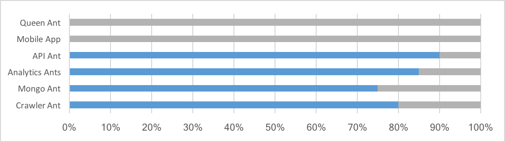

## Administrivia
- Status Updates - Release 1.0
- New Team Members
    * Benita Mordi
    * Darren Nixon
- Logins
- Moving Forward
    * Weekly Fire Ants Scrum (THU, 1500CST)
    * 2017 Fire Ants Launch (11-13APR)

## Roles
- **Cohen** - Containers & Orchestration (Docker), Platform (Digital Ocean → PCF), Object Store (MongoDB, Virtustream).  Secondary focus on Data Analytics.
- **Sweers** - Data Acquisition, APIs (Java).  Secondary focus on Mobile UI
- **Benita Mordi** - Data Acquisition, APIs (Java).  Secondary focus on Data Analytics.
- **Darren Nixon** - Mobile UI (React Native).  Secondary focus on Containers & Orchestration, Platform, Object Store.
- **Jason Battles** - Data Analytics (R).  Secondary focus on Platform, Mobile UI.
    
## Application Flow / Architecture Overview

## Release 1.0 Progress

* **Queen Ant** - new item to control crawler & system orchestration
* **UI** 
* **API Ant** - now operational.
* **Analytics Ant** - connect to API Ant. Quant bug.
* **Mongo Ant** - improve security
* **Crawler Ant** - containerize, schedule.

## Analytics Updates & Next Steps
* Defining interactions between MLB-API-Ant & MLB-Analytics-Ants
    - variables (MLBid, Date)
    - sample data format
    - sample URL
* Heat Map vs. HVal Map 
* Color Scheme Harmonization
* Object Storage
* Pitch Transformations
    - FS / SI / SF -> SI = fastball (sinker, split-fingered)
    - CB / CU -> CU = Curveball
    - UN / XX / PO / FO -> XX = not applicable

## API Integration Information (Sweers)

## Next Topics
1. Migrate MLB Analytics Ant Codebase to FireAnts Team GitHub (Battles)
  
## Summary Notes
- When do we migrate to Pivotal Cloud Foundry (PCF)?  We will migrate our codebase to PCF after Release 1.0 is delivered. 
- Primary Platforms - make sure your login works
    1. cloud.docker.com (Fire Ants team)
    2. github.com (Fire-Ants org)
    3. digitalocean.com (Fire Ants org)
- **03-GenerateImages.R** - example productiion code (https://github.com/fire-ants/mlb-analytics-ant/blob/master/03-GenerateImages.R)
- For next scrum...
    1. Nixon - updates on Mobile investigation
    2. Mordi - updates on R code discovery
    3. Sweers - updates on API formats

                                
