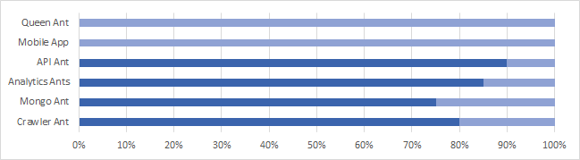

## Administrivia
* **2017 Fire Ants Launch** (11-13APR) - car, hotels
    + Location - [Sigma Solutions](https://www.google.com/maps/place/Sigma+Solutions+Inc/@36.1533956,-95.9942485,17z/data=!4m12!1m6!3m5!1s0x87b6eb79ba70a329:0x5a75ae8af23ccbe1!2sSigma+Solutions+Inc!8m2!3d36.1533956!4d-95.9920598!3m4!1s0x87b6eb79ba70a329:0x5a75ae8af23ccbe1!8m2!3d36.1533956!4d-95.9920598)
    + Day 1 
        - **APIAnt** (Aaron, Benita)
        - **MobileAnt** (Darren, Bat).
    + Day 2 
        - **MobileAnt** (Darren, Aaron), 
        -   **AnalyticsAnt** (Benita, Dan, Bat), 
    + Day 3 
        - **APIAnt** (Aaron, Darren), 
        - **AnalyticsAnt** (Benita, Dan), 
        - **QueenAnt** (Bat)

## Notes From Last Scrum
- **Fire Ants Overview** - https://my.syncplicity.com/share/t0z6hykpd7t7tlx/FireAnts-Overview
- **MementoMori** - quick app for calculating your life span (Battles, Sweers)
- Sweers to compare joined CSV to API and update
- Cohen to share sample image URL to Virtustream Object Store
- Sweers to continue development of API. Add player headshots and vitals.
- Sweers - new customer conversations regarding Continuous Integration (Shazam, Cambridge Investments).
- Nixon - Mobile UI "scaffolding". Redux for state mgmt & control.
- Cohen - eBag stateless web components.  Boto Python library.
- Battles - OU, state agencies. Application Mock-Ups. ReactNative initial effort (PropertyFinder)

## Topics
 - Around the Horn
 - [GitHub Issues](https://github.com/fire-ants)

## Application Flow / Architecture Overview

## Release 1.0 Progress

## Mobile Code Snippets (Nixon)

## Summary Notes
* Cohen, Bat to determine strategy for workload scheduling.
* Sweers to clean up old repositories
* Bat to send targeted MLBids to Darren