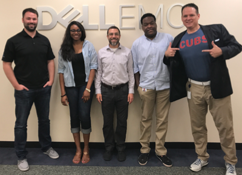
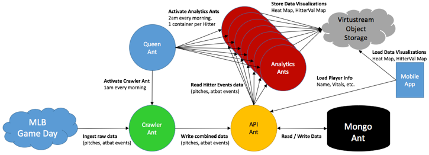

## Fire Ants - Denver

## Administrivia
- Fire Ants Workshops
    * 24-26OCT  Kansas City or Cambridge Dojo
    * 12-14DEC  Des Moine
    * 03-05APR  Chicago
- New Application Ideas
    * Rourke - Discount Tires & OnQ Financial ()
    * Davenport - Analytics & Visualizations
    * 
    
## Application Flow / Architecture Overview

## Release 1.0 Progress
* **UI** - updating head-shot URLs
* **Machine Learning Ant** - progress?
* **API Ant** - completed.  Fields may be added for machine learning
* **Analytics Ant** - completed. Heat Maps removed. 
* **Mongo Ant** - completed.
* **Crawler Ant** - completed.

## Summary Notes
* 
                                
