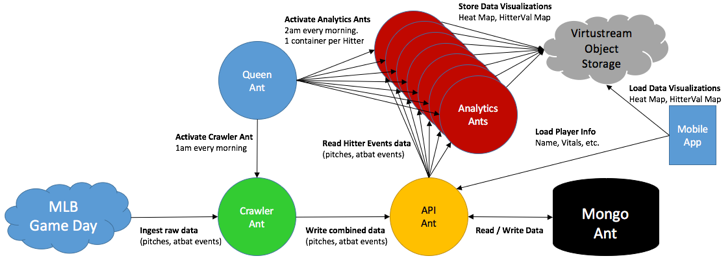

## Summary Notes
* Bat to schedule introduction with Colin
* Bee and Bat to schedule machine learning with Colin
* Bat to provide legalese and court cases to Nix
* Nix to submit to Google Play
* Bat to update workshop dates in the calendar.

## Fire Ants Workshop (Nix)
* Nix is hosting us in  **Kansas City**
* 1200, **07NOV**(TUE) thru 1700, **09NOV** (THU)

````Courtyard Kansas City Country Club Plaza````

````4600 J C Nichols Parkway, Kansas City, MO 64112````


# Upcoming Fire Ants Workshops
    * 07-09NOV (orig 24-26OCT)  Kansas City 
    * 06-08FEB? (orig 12-14DEC)  Des Moine - calendars updated
    * 03-05APR  Chicago
    
## New Application Ideas
    * Rourke - Discount Tires & OnQ Financial 
    * Davenport - Analytics & Visualizations
    * Cohen - 2 Song Break (cloud foundry app with API to Spotify)
    * Goyette - Modernization of Tools (i.e. OpsConsole, CST)
    
## Administrivia
- Around the Horn
    * Cohen - 
    * Sweezy - 
    * Nixon -
    * Mordi - 
    * Goyette - sampling and "forest of trees"
    * Battles - 
    

## Application Flow / Architecture Overview


## Release 1.0 Progress


* **Mobile Ant** - updating head-shot URLs.  Google Play, Apple Store submissions.
* **Machine Learning Ant** - challenges with parsing Classification Trees.
Altuve. zone, p_type, away, 90% GOOD for a pitcher.  nasty<60 85% BAD for pitcher
* **Analytics Ant** - completed. Dan to activate via cron. 
* **Crawler Ant** - scheduling

## Summary Notes
*
                                
                                
