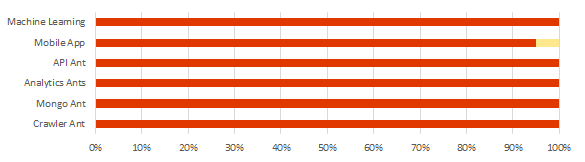

## The Fire Ants

## Summary Notes
* Bat to get iTunes Connect operational. 
* Bat to migrate to new Slack environment.
* Bat / Sweers to upload PF
* Bee to update app flow diagram.  MTG 19DEC.
* Bat to onboard additional team members (Kenny, Kurt?)
* Bat to schedule module review.
* Sweers to create Fire Ants blog.  All team members contribute content
* Nixon working to pull ML guidance from API

## Administrivia
* 2018 Scrum Schedule - THU afternoon still okay? GOOD
* LinkedIn - https://www.linkedin.com/company/the-fire-ants/
* Upcoming Fire Ants Workshops
    - **06-08FEB** Des Moines
    - **03-05APR** Chicago
    - **JUN NYC?** - Pivotal office? Kenny to inquire.
    
## Targeted Applications
    * Pitcher's Friend 2.0
        - Update machine learning algorithm
        - add ML to mobile app
        - migrate to Pivotal Cloud Foundry
    * F5 - Tornado Alley Data Analytics 
    
## Around the Horn

* **Cohen** - CUST MTG
* **Sweezy** - working on the WordPress blog
* **Nixon** - TRNG
* **Mordi** - updating app flow diagram
* **Goyette** - working draft of analytics write-up. share via slack. developing ideas for improving model.
* **Sabarese** - PKS as viable option? 4 factor app works fine too. Explore PKS via separate meeting and slack
* **Telep** - evaluate 12 factor. build-packs. PCF account structure/funding. 
* **Battles** - Marketing & Recruiting
      
## Release 1.0 Progress

* **Mobile Ant** - Apple Store submissions.
* **Machine Learning Ant** 
* **Analytics Ant**   
* **Crawler Ant** 

## Summary Notes
                    
                                
