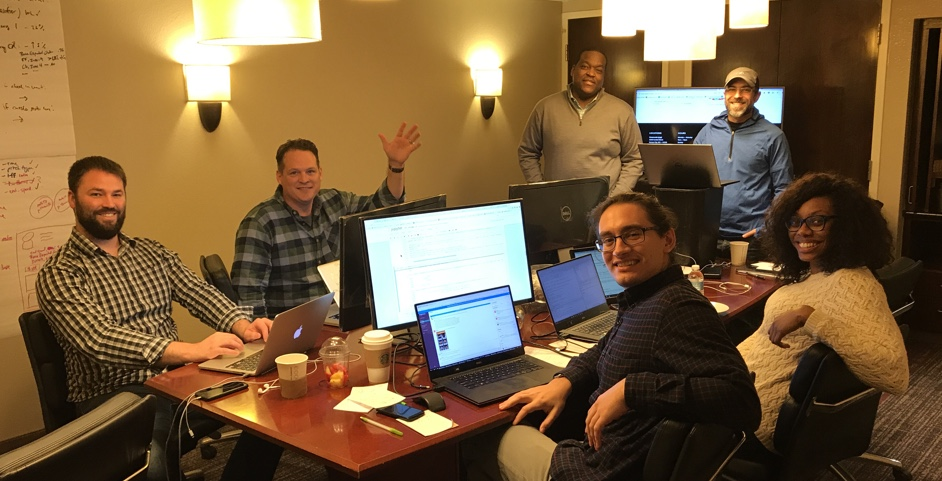
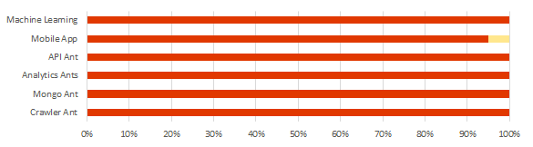

## The Fire Ants

## Items in Flight
* Bat / Sweers to upload PF.  Errors remain
* Bee to update app flow diagram. 
* Bat to onboard additional team members (Kenny, Kurt?)
* Bat & team to schedule module review. 30JAN as template.
* Sweers to create Fire Ants blog.  All team members contribute content
* Nixon working to pull ML guidance from API
* Bat has some movement on EMC Dojo

## Administrivia
* 2018 Scrum Schedule - invitations updated.
* LinkedIn - https://www.linkedin.com/company/the-fire-ants/
* Upcoming Fire Ants Workshops
    - **06-08FEB** Des Moines.  We will make this virtual or EMC Dojo.
    - **03-05APR** Chicago
    - **JUN NYC?** - Pivotal office? Kenny to inquire.
    
## Targeted Applications
    * **Pitcher's Friend 2.0** (PRIMARY)
        - Update machine learning algorithm
        - add ML to mobile app
        - migrate to Pivotal Cloud Foundry or PKS
    * F5 - Tornado Alley Data Analytics (SECONDARY)
    
## Around the Horn (a.k.a. Discoveries this week)

* **Cohen** - absent
* **Sweezy** - automated restores into Azure has limitations from virtual data domains. LiveOptics has some challenges with specific metrics. Be aware and double-check.
* **Nixon** - upgrade / expansion should be co-term with parent platform.  
* **Mordi** - NSX training.  2 licensing options.  (NSX-T, NSX-V).  PCF for Analytics.
* **Goyette** - inference methods for ML.  Spectre/Meltdown - website ads are a common attack vector.  Performance impact (5%-30%) are mainly associated with OLTP and high-write environments, small block.
* **Sabarese** - Digital Ocean is Isilon customer (4.5PB).  VSAN Training VXRail Test Drive.  VSAN is an object store, not a file system.
* **Telep** - absent
* **Battles** -  State of Nebraska (agile). Virtustream Xstream on-prem M&O stack. Kubernetes growing. VRS transition.
      
## Release 1.0 Progress

* **Mobile Ant** - Apple Store submission error
* **Machine Learning Ant** 
* **Analytics Ant**   
* **Crawler Ant** 

## Summary Notes
                    
                                
