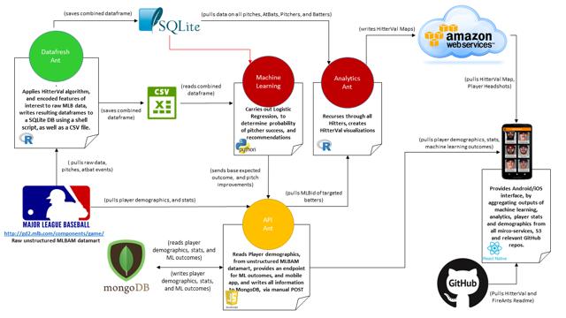

## Pitchers Friends - Microservice Overview

## Items in Flight
* Bat made 1 final last ditch effort **EMC Dojo** 
* Bat deploying **Fire Ants Site/Blog**
* [Pitchers Friend now in the Apple Store!](  https://itunes.apple.com/us/app/pitchers-friend/id1309804498?mt=8)
* Mordi speaking engagement. Updates?

## EMC Dojo
* Complete bust in regards to in-person dojo experience.
* PCF101/201 Training (which days 23-27APR?)
    - high-level topics
    - specific questions
* Pivotal Acceleration Lab. https://pivotal.io/platform-acceleration-lab?confirmation

## Fire Ants Site / Blog
*  [Fire Ants site / blog](  https://jasonrbattles.wixsite.com/fireants)  https://jasonrbattles.wixsite.com/fireants
* Your action needed
     - Review site.  Provide feedback
     - Sign-Up for blog
     - Collaborators?
     - Need marketing banner for Cost-To-Protect

## Administrivia
* Upcoming Fire Ants Workshops & Workshops (To Be Discussed)
    - **??TBD** - Pivotal Acceleration Lab
    - **12-15JUN** - DockerCon (SFO)
    - **07-09AUG** - Chicago 
    - **06-08NOV** - NYC.  Pivotal office? Kenny to inquire.
    
## Around the Horn (a.k.a. Discoveries this week)

* **Cohen** - 
* **Sweezy** - 
* **Nixon** - cutomer tech profile mtg.
* **Mordi** - 
* **Goyette** - 
* **Sabarese** - 
* **Battles** -  

## Summary Notes
                    
                                
