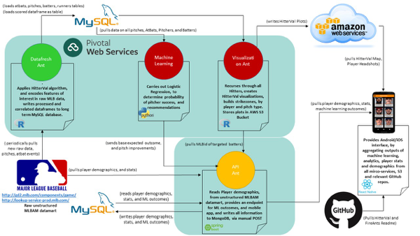

## PF2.0 ACTION ITEMS (I)

* **DataFresh Ant** - Good to Go.
* **MachineLearning Ant** - Good to Go.
* **Visualization Ant** - Built as docker container and pushed via PAS. Building validation now after recursive updates.
* **API Ant** - AS determining direction for player aggregation. CG offered to create edge test for appropriate number of AtBats.
* **Mobile Ant** - Scheduling session to push to Apple Store and Google Play

## PF2.0 ACTION ITEMS (II)

* **Digital Ocean Cleanup** - COMPLETE
* **DataFlow** - KS to schedule pair programming 
* **PF App Flow Diagram** - BM submitted updates

## INTERESTING TIDBITS 
 
    

                  

                                
