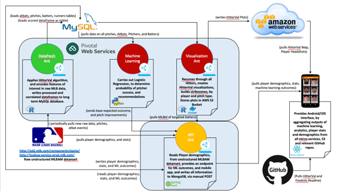
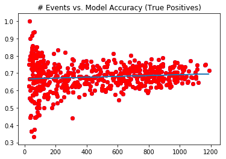

## ADMIN

* Colin has great opportunity at Domino Data Labs
* Discuss hiatus until 15AUG.  In the meantime...
    - Recruit / Refit
    - Refine PF Roadmap
    - Monitor PAS Updates

## PF2.0 ACTION ITEMS (I)

* **DataFresh Ant** - Good to Go.
* **MachineLearning Ant** - Good to Go.
* **Visualization Ant** - DC and JB met to review code.  Definied remaining issues in GitHub.
* **API Ant** - update?
* **Mobile Ant** - Pushed code to Apple Store and Google Play.  Update Apple Store record

## PF2.0 ACTION ITEMS (II)

* **DataFlow** - KS to schedule pair programming 
* **PF App Flow Diagram** - BM submitted updates
    

## DISCUSSION - Machine Learning Model

Summary: ML model needs to be improved in the next release.

Net/net: model performance is basically flat line, performance wise, when evaluated against random sample OR entire training set, excluding pitchers with low pitch counts.

## DISCUSSION - Machine Learning Model Details

* 90 days worth of data successfully pulled , 4/17-7/17
    - 790 unique batters in this time period
    - RHP: 578 unique batters with >30 pitches in this time frame. Essentially equivalent to excluding lowest quartile, e.g., lowest 25% of batters via pitch count
    - LHP: Similar– 510 unique batters with >22 pitches (25th percentile)
* Evidence of 'edge' of useful range of event counts when using Logistic REegression: Model performance "trend" v event count depends on whether we train model on entire dataset or keep a validation set

* **TRUE TEST** would be maintaining a validation set that is the last, say, 25% of timeframe. Can we truly preduct the future by training on past data greater loss in model performance observed with low event counts when eval model with validation set

## DISCUSSION - ML Recommendations

1. Try new/other algorithms - Decision Trees, Tree regression, etc 
2. Reduce time frame from 90d? Do this in conjunction with 2.a.iii.1 "true" test of model's ability to predict future performance
3. Suggest limiting to users with >200-400 pitches in time frame, if sticking with current model. Still need to evaluate this. 

## ROADMAP - The Pitcher's Friend

* 2.0
    - ~10 defined hitters
    - PROD running on PAS
    - Concourse Pipeline
* 2.1
    - All players on 40 man roster (30 teams) = 1200 players
    - Restricted to hitters (players that have seen >200 pitches)
    
    
## INTERESTING TIDBITS 
 
    

                  

                                
