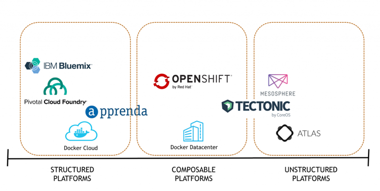

## People
Start with “who?” before we focus on “what?”.

- **Dan Cohen**
- **Brian Moran**
- **Aaron Sweers**
- **Jason Battles**

## Mission
The Mountain Plains Application Development Team (a.k.a ***Fire Ants***) will develop and deploy Cloud Native Applications using modern frameworks to enhance clarity for our customers, our team, and ourselves.

1. Build a Cloud Native Application (Unstructured /Composable and Structured PaaS)
2. Disrupt ourselves to learn new things
3. Develop a new level of relevance

## Organization

- **Consensus** - Team consensus will guide our actions.  
- **Benevolent Military Dictatorship** - If consensus not achieved, then I decide….with love and benevolence in my heart.

## Going Forward

- **Be Here** - We need all the oars in the water.
- **Be Authentic** - Share what you know, think you know, and do not know.
- **Be Loving your Neighbor** - Come alongside and add to the collective knowledge.
- **Be Heard** - This is a safe place.  Ask if you are not clear on something
- **Be Decisive** - 24 hour timeframe.  

## Roles & Skill Categories

Like all high-speed task forces, you have been carefully selected for your skillsets (current and targeted for development).  

- Micro-Service Architecture
- Code Repo - <http://www.github.com>
- Image Repo
- App Dev
- PaaS Architecture
- Scheduling 
- Monitoring
- Database
- Battle Buddies - 2 man teams deployed to tackle complex tasks.  

## Decide on First Project

1. **MLB Hitter Analysis** - good data, unclear objectives
2. **EMC Technology Refresh** - medium quality data, clear objectives, concerns about security
3. **District Calendars** - Publish consolidated Internet calendars. Possible conflict with existing toolsets.
4. **Other Ideas?**

## Discussion

## Potential Architecture

## Recommended Links
* Composable PaaS - 
<http://wikibon.com/architectural-considerations-for-open-source-paas-and-container-platforms/>
* Fire Ants Meetings
<https://github.com/jrbattles/fire-ants-mtgs>
* DrillingInfo - Coversion to Docker
<http://synerzip.com/wp-content/uploads/2015/10/Microservices-on-Docker-Webinar-Synerzip.pptx>

## Next Steps
1. Code Repository - GitHub
    * Fork this repo - <https://github.com/jrbattles/fire-ants-mtgs>
    * Commit some changes
    * Submit pull request
2. ChatOps - ??
3. Task Tracking - ??
4. Scrum / Sprint Schedule - ??
5. Schedule Meetings - Bat
5. Others?

## Summary Notes

Task #1 - GitHub Account (use personal email).  Fork the **fire-ants-mtg** repo, commit the changes and submit a push request. 

Task #2 - Docker Hub account (use personal email)

Task #3 - Cohen to own task tracking (and/or ChatOps) tool and make recommendations.

Decision #1 - Weeekly Scrum Meetings. Bi-weekly Sprints.  Battles to schedule.

Decision #2 - Email for team communications. Task Tracking tool for project comms. 

## R Markdown

This is an R Markdown presentation. Markdown is a simple formatting syntax for authoring HTML, PDF, and MS Word documents. For more details on using R Markdown see <http://rmarkdown.rstudio.com>.

When you click the **Knit** button a document will be generated that includes both content as well as the output of any embedded R code chunks within the document.

## Scooter's Slide

- Installed R + R Studio + R Markdown

- Starting to learn Docker and highly recommend these courses on PluralSight - <https://app.pluralsight.com/paths/skills/docker>.

- This is my very first Git commit

