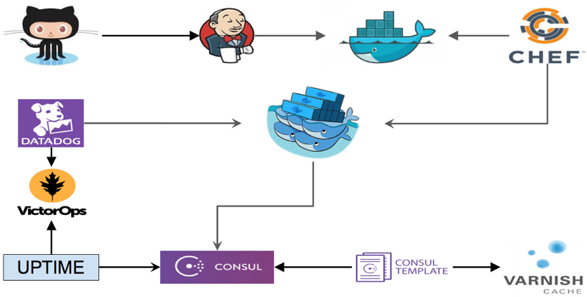

## People
Start with “who?” before we focus on “what?”.

- Dan Cohen
- Brian Moran
- Aaron Sweers
- Jason Battles

## Mission
- Build a Cloud Native Application (Unstructured & Structured PaaS)
- Disrupt ourselves to learn new things
- Develop a new level of relevance

## Organization

- Benevolent Military Dictatorship.  
- Consensus - Team consensus will guide our actions.  If consensus not achieved, then I decide….with love and benevolence in my heart.

## Roles & Skill Categories
Like all special force units and task forces, you have been carefully selected for your skillsets (current and targeted for development).  

- Micro-Service Architecture
- Code Repo
- Image Repo
- App Dev
- PaaS Architecture
-  Scheduling 
-  Monitoring
- Database
- Battle Buddies - 2 man teams deployed to tackle complex tasks.  

## Decide on First Project
1. MLB Hitter Analysis
2. EMC Technolgoy Refresh
3. Other Ideas?

## Potential Architecture

## Next Steps
1. Code Repository - ??
2. ChatOps - ??
3. Task Tracking - ??
4. Scrum / Sprint Schedule - ??
5. Schedule Meetings - Bat
5. Others?

## R Markdown

This is an R Markdown presentation. Markdown is a simple formatting syntax for authoring HTML, PDF, and MS Word documents. For more details on using R Markdown see <http://rmarkdown.rstudio.com>.

When you click the **Knit** button a document will be generated that includes both content as well as the output of any embedded R code chunks within the document.
