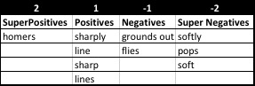

## Wave1 Objectives (Battles)
- Last 25 Outcomes per Batter
- Scatterplot of Pitches per Batter
- Live Game Sonar
- Hit Sonar

## Investigate Pitch F/X MLB Data (Battles)

here is a [sample inning XML file](sample-data/gid_2015_09_05_texmlb_anamlb_1/inning/inning_all.xml)

## HitterValue - Quantitative (I)
Pitch               Value
--------            --------
Hit Sharply-on base 1.5
Hit Sharply-out     1.5
FlyBall-on base hit 1
FlyBall-out         0.8
Grounder-on base hit0.5
Grounder-out        0
Swinging Strike     -0.3
Called Strike       -0.3

## HitterValue - Quantitative (II)
Pitch           Value 
-----           -----
Foul            -0.3
Ball            0
Ball In Dirt    0
In play, run(s) 0
In play, no out 0   
Pitchout        0
Hit By Pitch    0

## HitterValue - Qualitative (I)

                                
## Neo4j Overview (Sweers)

## Skills Overview (Sweers)

## Task Tracking (Cohen)

## Next Steps
1. Application Mock-Up

## Summary Notes

## HitterValue - Qualitative (I)

SuperNeg(-2)    Neg(-1)         Pos (+1)    SuperPos(+2)
--------        ---             -----       ------- 
softly          grounds out     sharply     homers
pops            flies           line
soft                            sharp
                                lines
                                
