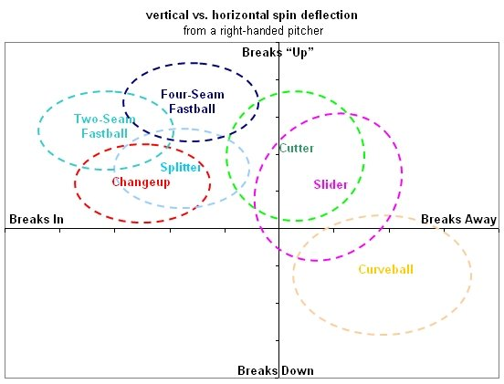

## Administrivia
- Confirm fireants.io email operational (Cohen, Sweers)
- Looking for ReactNative / Swift Experience
- New News & Learning Updates? (All)

## Database Overview 
* MongoDB deployed
* Store information as natively as possible.
* Data Volume (not deployed for now.  2Mb per 50 games)
* Next Steps?

## Analytics Updates & Next Steps
* Defining interactions between MLB-API-Ant & MLB-Analytics-Ants
    - variables (MLBid, Date)
    - sample data format
    - sample URL
* Heat Map vs. HVal Map 
* Color Scheme Harmonization
* Object Storage
* Pitch Transformations
    - FS / SI / SF -> SI = fastball (sinker, split-fingered)
    - CB / CU -> CU = Curveball
    - UN / XX / PO / FO -> XX = not applicable
    
## Pitches (Looking at RHP)

## Docker Swarm Cluster Overview (Moran)
* Updates on Rocker?

## API Integration Information (Sweers)

## Next Topics
1. MLB Pitchers Friend - Detailed Architecture Overview (Battles)
3. Migrate MLB Analytics Ant Codebase to FireAnts Team GitHub (Battles)

## Summary Notes

                                
