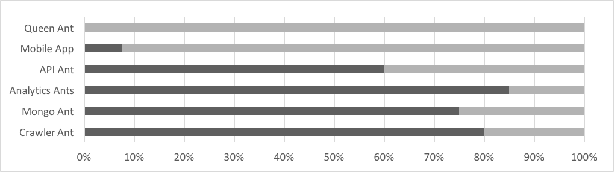

## Administrivia
- Questions
    * Scheduling Containers
    * Containerized Java
- New News & Learning Updates? (All)
- Moving Forward
    * Application Flow
    
## Application Flow / Architecture Overview

## Release 1.0 Progress

* **Queen Ant** - new item
* **UI** - no focus. 6% due to Hello World.
* **API Ant** - link to the database, test, containerize.
* **Analytics Ant** - progress on Object Store, containers... Need to unhook PitchRx, vars, cols, native ggplot.
* **Mongo Ant** - SSH connectivity confirmed.
* **Crawler Ant** - containerize, schedule.

## Analytics Updates & Next Steps
* Defining interactions between MLB-API-Ant & MLB-Analytics-Ants
    - variables (MLBid, Date)
    - sample data format
    - sample URL
* Heat Map vs. HVal Map 
* Color Scheme Harmonization
* Object Storage
* Pitch Transformations
    - FS / SI / SF -> SI = fastball (sinker, split-fingered)
    - CB / CU -> CU = Curveball
    - UN / XX / PO / FO -> XX = not applicable
    
## Docker Swarm Cluster Overview (Moran)
* Updates on Rocker?

## API Integration Information (Sweers)

## Next Topics
1. MLB Pitchers Friend - Detailed Architecture Overview (Battles) - DONE
3. Migrate MLB Analytics Ant Codebase to FireAnts Team GitHub (Battles)

## Summary Notes
* scheduling tasks working with DockerSwarm (Brian)
    - Persistent Containers - API-Anti, Mongo-Ant
    - Scheduled Containers - Crawler-Ant, Analytics-Ant
* Create username / password on MongoDB (Battles)
* Restrict access IPs for MongoDB for security (Battles)
* Connect to Virtustream Object Store (Cohen)
* Crawler - 

                                
