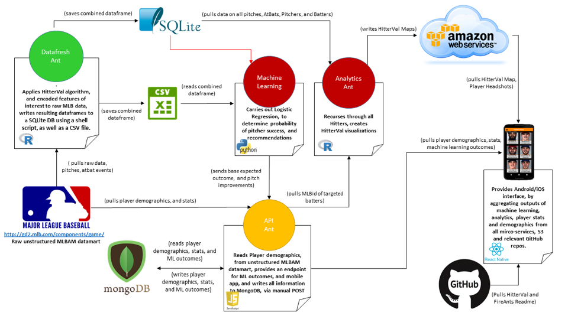

## November Workshop Development Goals
1.  Implement Concourse Pipeline
2. Re-Platform micro-services on **PAS**
    - **mlb-datafresh**
    - mlb-analytics-ant  
    - mlb-machine-learning
    - mlb-player-api 
3. Evaluate data services for proper placement (CSV, SQLite, mLab mongo)
4. Add Machine Learning guidance to mobile app.

## Pitchers Friends - Microservice Overview

 
## Funshop Format - MON 
**MON, 12NOV 0900 - 1700**

* Review issues in GitHub repo.  
* Dust-off the cobwebs and get to work.  
* Begin implementing Concourse Pipeline (3 Pivots)

    1. mlb-datafresh (Cohen,Sabarese,Stewart) 
    2. mlb-machine-learning (Goyette, Mordi, Vorhees)
    3. mlb-player-api (Sweers,Nixon,Kunjummen)

## Funshop Format - TUE 
**TUE, 13NOV 0900 - 1700**

* Continue implementing Concourse Pipeline (3 Pivots)
* Re-platform micro-services on PAS
* Re-platform data stores
* Update mobile app to accomodate ML guidance.   

## Funshop Format - WED 
**WED, 14NOV 0800 - 1700**  

* Complete re-platforming micro-services
* **BHAG** - Deploy PF2.0 to Apple Store

## Some Additional Nuggets
* Fire Ants Website – http://www.fireants.io            
* Fire Ants GitHub – https://github.com/fire-ants
* Fire Ants Docker Cloud - https://cloud.docker.com/app/fireants/dashboard/onboarding/cloud-registry
* Fire Ants & Pitcher’s Friend Overview - https://my.syncplicity.com/share/e1dflecfjvimezf/FireAnts-Overview-20180412  

              
